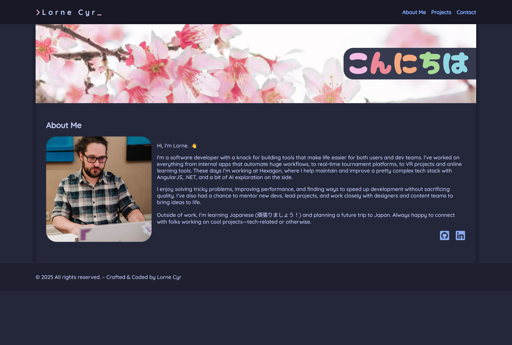

# React Portfolio

## Description

This is a portfolio website built using React (originally bootstrapped using create-react-app but recently migrated to Vite build tool). The projects page is dynamically generated from a JSON file. I chose to use folders for my components to assist with the organization, since I opted to use CSS modules for styling rather than inline css. I prefer CSS modules over inline css because:

- It allows me to keep my css in a separate file, which is easier to read and maintain.
- It allows me to use the same class names in different components without worrying about conflicts.
- It allows me to take advantage of all the features of CSS, such as media queries, pseudo classes, etc.

You can view the deployed site [here](https://llourn.github.io/react-portfolio).

## Table of Contents

- [Installation](#installation)
- [Available Scripts](#available-scripts)
- [Credits](#credits)
- [License](#license)

## Installation

Requirements:

- Node v18.x

Instructions:

- clone this repo.
- cd into project directory
- npm install
- `npm run start`

## Available Scripts

In the project directory, you can run:

### `npm start`

Runs the app in the development mode.\
Open [http://localhost:5173](http://localhost:5173) to view it in your browser.

The page will reload when you make changes.

### `npm run build`

Builds the app for production to the `build` folder.\
It correctly bundles React in production mode and optimizes the build for the best performance.

The build is minified and the filenames include the hashes.\
Your app is ready to be deployed!

See the section about [deployment](https://facebook.github.io/create-react-app/docs/deployment) for more information.

## License

MIT License Copyright (c) 2025 Lorne Cyr

## Badges

## Credits

[Catppuccin Theme](https://github.com/catppuccin/catppuccin)
